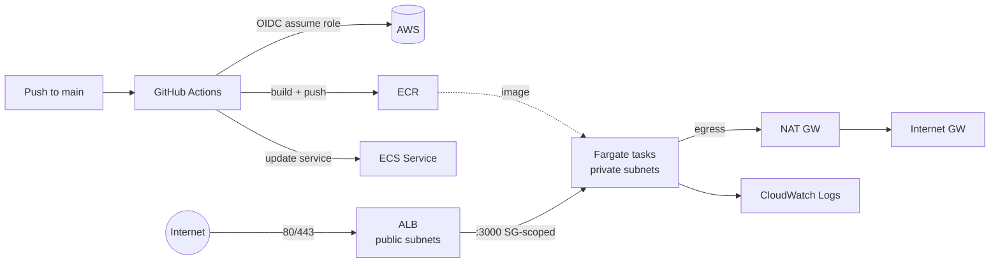

# tam-server-node

> Senior DevOps / Platform Engineer — technical challenge.

A small Node HTTP server deployed to **AWS ECS Fargate** behind an **Application
Load Balancer**, provisioned entirely with **Terraform** and shipped through
**GitHub Actions** CI/CD.

- `GET /` → `Hello world`
- `GET /health` → `200 {"status":"ok","uptime":N}` (ALB + container health check)

## Architecture



**Why these choices**

| Decision | Choice | Rationale |
|---|---|---|
| Cloud | AWS | Assessment values AWS depth |
| IaC | Terraform | Their standard; flat config, one root module |
| Runtime | ECS Fargate | No node management, fast to stand up, defensible for a single service. K8s is overkill here (see portability notes) |
| Ingress | ALB + ACM | L7 entry point, TLS termination, `/health` target-group checks |
| CI/CD | GitHub Actions + OIDC | Their tool; OIDC = no long-lived AWS keys in the repo |
| Registry | ECR | Native, scan-on-push, lifecycle-pruned |

**Network / security posture**
- ALB in **public** subnets; tasks in **private** subnets with no public IP.
- Task SG only accepts `:3000` **from the ALB SG** (not a CIDR) — least privilege.
- TLS 1.2/1.3 policy on the HTTPS listener; HTTP → HTTPS 301 redirect when a domain is set.
- Container runs as **non-root**, **read-only root filesystem**, minimal alpine image.
- IAM split: execution role (pull/log) vs task role (app identity, empty today).
- CI/CD role scoped to *this* ECR repo + *this* ECS service via OIDC `sub` = `repo:owner/name:*`.

## Layout

Kept as flat Terraform (one root module) — the stack is small enough that
per-concern files read more directly than a module tree. It started modular;
flattening it is a deliberate simplification (see `docs/decisions.md`).

```
app/                 Node server + Dockerfile + tests
infra/               Terraform root (flat)
  network.tf         VPC, subnets, IGW, NAT, routes
  ecr.tf             Image registry
  alb.tf             ALB, SG, target group, ACM, listeners, Route53
  ecs.tf             Cluster, task def, service, IAM, logs, task SG
  oidc.tf            GitHub OIDC provider ref + least-privilege CI role
  main.tf            Locals + shared data sources
scripts/             bootstrap.sh + its README (one-time, out-of-band)
.github/workflows/   ci.yml (test), terraform.yml (plan/apply), deploy.yml (ship)
docs/                decisions.md (trade-offs), pricing.md (cost model)
```

## Run locally

```bash
cd app
npm test
docker build -t app . && docker run -p 3000:3000 app
curl localhost:3000/ && curl localhost:3000/health
```

## Bootstrap (once per account)

A few things must exist **before** any pipeline can run Terraform — the classic
chicken-and-egg. One idempotent, out-of-band script creates them:

```bash
AWS_PROFILE=<profile> ./scripts/bootstrap.sh
```

It provisions the S3 state bucket, the GitHub OIDC provider, and the broad
TF-runner role. Full explanation and the GitHub secrets to set afterwards:
[`scripts/README.md`](scripts/README.md).

## Deploy

After bootstrap the flow is fully pipeline-driven:

1. **`terraform.yml`** (manual dispatch → `apply`) provisions the infra and
   creates the scoped app-deploy role. First apply seeds the ECS service with a
   `bootstrap` placeholder tag (no image yet).
2. **`deploy.yml`** (push to `main` / manual) builds the image, pushes to ECR,
   and rolls the ECS service to it.

For a local apply instead:

```bash
cd infra
cp terraform.tfvars.example terraform.tfvars   # or rely on prod.auto.tfvars
terraform init
terraform apply
```

App URL: `terraform output app_url` → https://tam.nicolasandrescalvo.com

**Tear down** (between demos, to avoid cost): `terraform.yml` → `destroy`, or
`terraform destroy` locally.

## TLS

`prod.auto.tfvars` sets `domain_name` + `route53_zone_id`, so Terraform requests
a DNS-validated ACM cert, adds the validation + alias records in the existing
`nicolasandrescalvo.com` zone, and switches the ALB to HTTPS:443 with an
HTTP→HTTPS redirect. Clear both to serve plain HTTP on the ALB DNS name.

## Cost

~$75–80/mo if left running 24/7 (NAT + ALB + 2 Fargate tasks dominate). Run it
the day before the interview and destroy after → under a dollar. Full model and
cost levers: [`docs/pricing.md`](docs/pricing.md).

## More

- [`docs/decisions.md`](docs/decisions.md) — cross-cloud portability answer,
  observability plan, and the deliberate trade-offs.
- [`docs/pricing.md`](docs/pricing.md) — cost model and levers.
